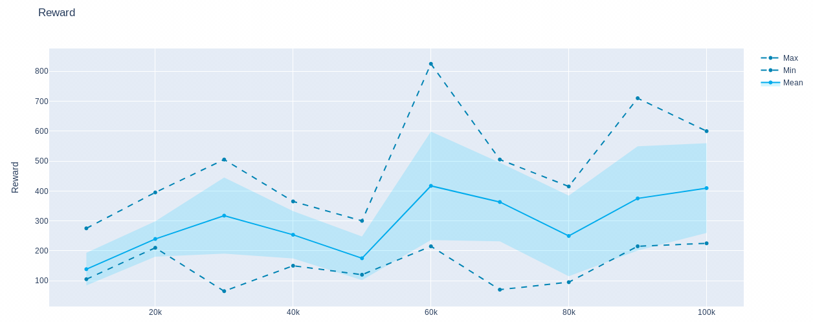
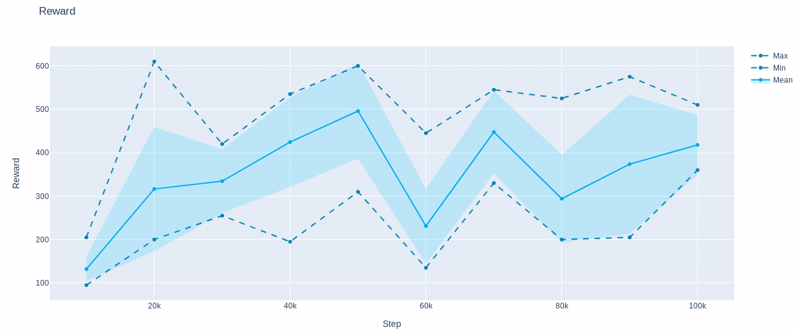

Test on Rainbow with AdaBelief
=======
This code is modified from two repositories:<br>
Rainbow: https://github.com/Kaixhin/Rainbow<br>
AdaBelief: https://github.com/juntang-zhuang/Adabelief-Optimizer<br>

## Dependencies
```adabelief-pytorch==0.0.5```

## How to run
#### Train with AdaBelief
```sh run.sh```
#### Train with Adam
See documentation in https://github.com/Kaixhin/Rainbow

## Results
Results are in the folder ```results/default```. We provide the results for two independent runs with AdaBelief.

#### Adam


#### AdaBelief

